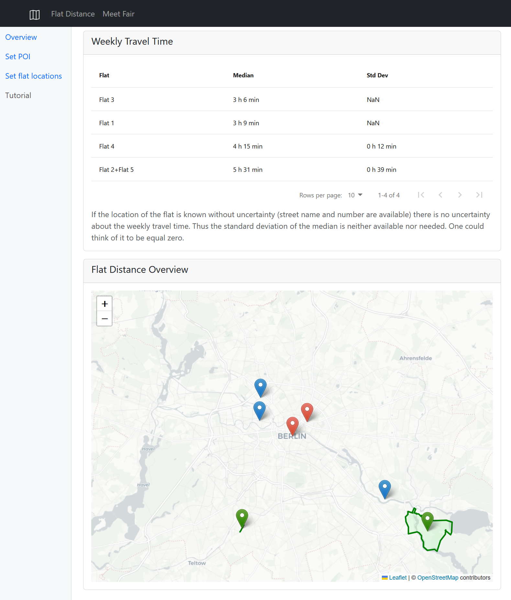
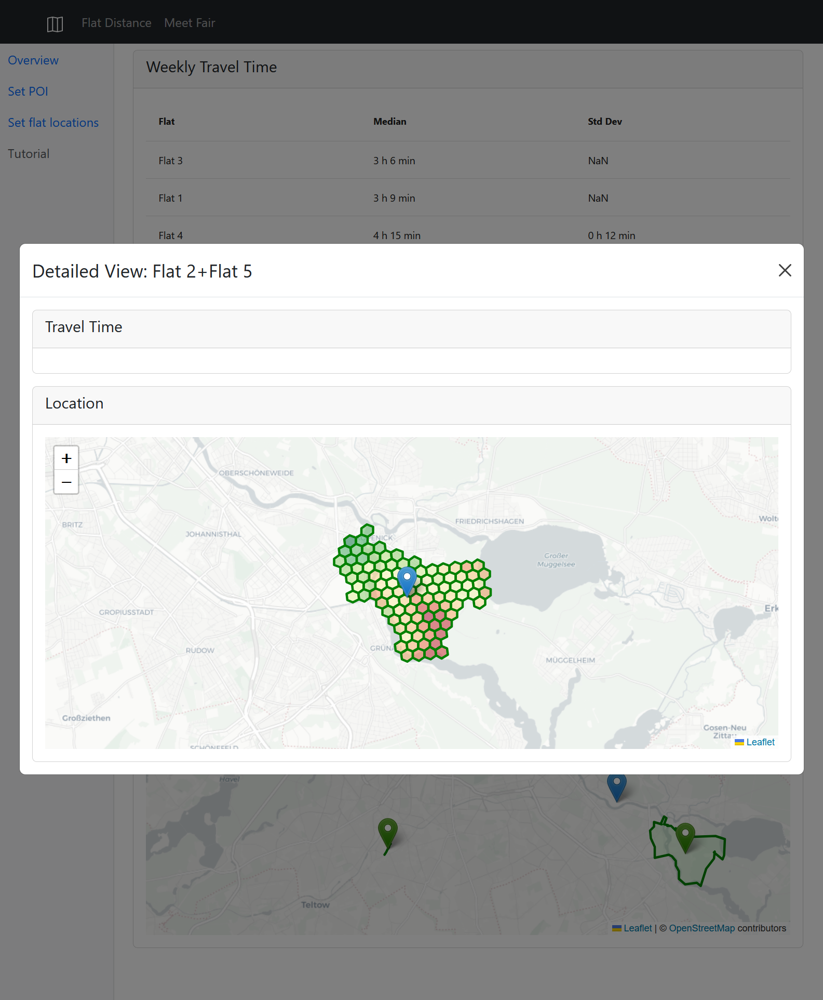

# Flat location rater

The ideas for these apps were presented by Jannis at his presentation at BHT Data Scienc class.

Especially, the idea to get information on how well a location (e. g. for a possible new flat) is connected to points of interests one visits following a regular schedule, was appealing to me.

This became urgent recently, because I will change my job and finding a closer flat to the future job location, would be nice.

If this app works well, it will be handy for many more people than my first idea.

## Preview

After setting the points of interest and the weekly travel schedule and the information about flat locations one gets this overview:

If the location of the flat is not fully determained by street name and number one can get a detailed estimation for travel time for a hex raster covering the possible area (a street or a postcode area):

## Usage

This app uses a flask backend and react frontend. To execute it during developement one needs to start the app.py and run the react frontend by `npm start`.

For deployment one only has to host a flask server after one builds the one page version.

## Possible extensions

* add support for routing with car, bike or per pedes
* guess location of flat based on description text for flats by identifying distance relations to e.g. grocery or public transport stations
* show isochrones for poi so one maight can see faster what can be a good spot for a flat?